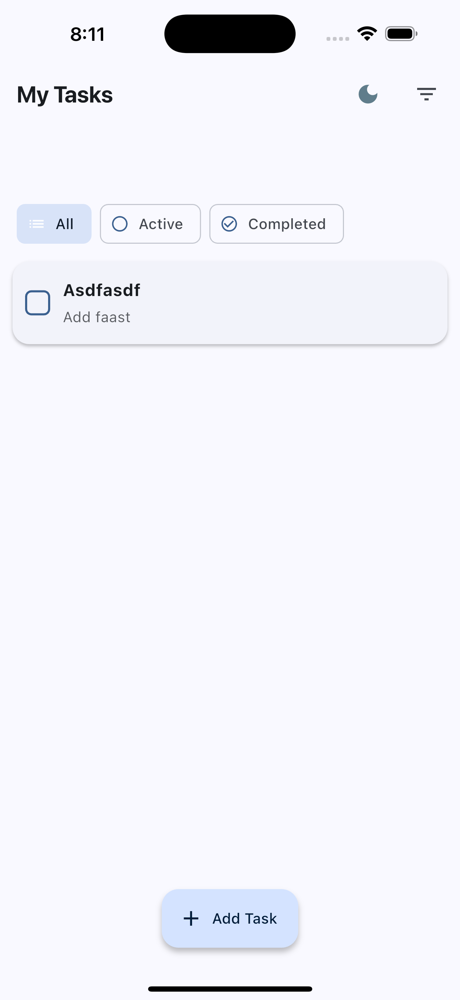
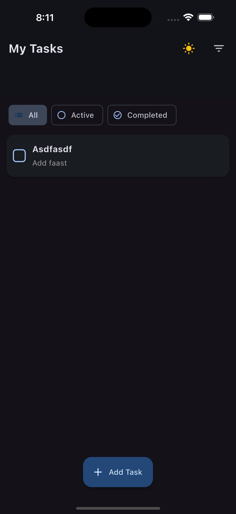
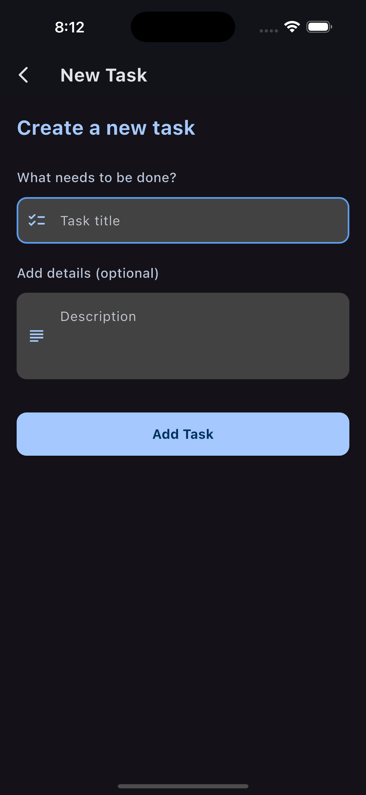
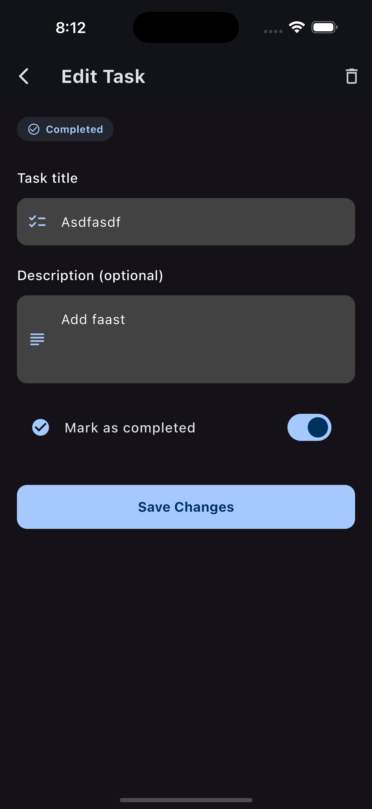

# Flutter Todo App

A beautiful and feature-rich Todo application built with Flutter. This app allows users to manage their tasks with a clean, modern UI and offers both light and dark themes.


## Features

- ✅ Create, edit, and delete tasks
- 🔄 Mark tasks as complete/incomplete with visual indicators
- 🗂️ Filter tasks (All, Active, Completed)
- 🌓 Switch between light and dark themes
- 💾 Persistent data storage using shared_preferences
- 🎨 Beautiful, animated UI with Material Design
- ⚡ Efficient state management with Provider

## Screenshots

<div style="display: flex; flex-wrap: wrap; gap: 10px; justify-content: center;">
    
    
    
    
</div>

## Setup Instructions

### Prerequisites

- Flutter SDK (2.0.0 or higher)
- Dart SDK (2.12.0 or higher)
- Android Studio / VS Code with Flutter extensions
- An Android or iOS device/emulator

### Installation

1. Clone this repository:
   ```bash
   git clone https://github.com/yourusername/todo.git
   cd todo
   ```

2. Install dependencies:
   ```bash
   flutter pub get
   ```

3. Run the app:
   ```bash
   flutter run
   ```

## Project Structure

```
lib/
├── models/
│   └── task.dart              # Task data model
├── providers/
│   └── task_provider.dart     # State management for tasks and theme
├── screens/
│   ├── add_task_screen.dart   # Screen for adding new tasks
│   ├── edit_task_screen.dart  # Screen for editing existing tasks
│   └── home_screen.dart       # Main task list screen
├── services/
│   └── task_service.dart      # Task data persistence service
├── widgets/
│   └── task_item.dart         # Individual task item widget
└── main.dart                  # App entry point and theme configuration
```

## Dependencies

- [provider](https://pub.dev/packages/provider): State management
- [shared_preferences](https://pub.dev/packages/shared_preferences): Local storage
- [uuid](https://pub.dev/packages/uuid): Generating unique IDs for tasks

## Usage

- **Adding a Task**: Tap the "Add Task" floating action button, fill in the details, and save
- **Completing a Task**: Tap the checkbox next to a task to mark it as complete
- **Editing a Task**: Tap on any task to edit its details
- **Deleting a Task**: Swipe a task from right to left or tap the delete icon in the edit screen
- **Filtering Tasks**: Use the filter chips or menu in the app bar to filter tasks
- **Changing Theme**: Tap the light/dark mode icon in the app bar to toggle between themes


## Credits

Developed by Raman Tank
